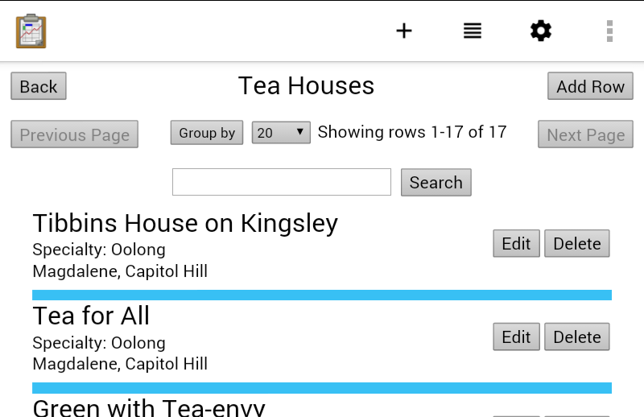

## formgen

## Getting started

First, clone [the app designer repo](https://github.com/opendatakit/app-designer), and set the path of where you cloned it to in the `appdesigner` variable in `utils.py`

Then run `make all appname=your_app_name` to generate forms and automatically copy them to your app designer repo. Change `all` to `deploy` to have them sent to a connected device as well.

To have `make` remember your app name, add a target to the Makefile. There are two examples to copy from already in there

## Configuring list/detail views

By default, running `make` will generate a `list.html` and `detail.html`. These are generic files that you can set your list view or detail view filenames to and they will work ok, however they probably won't do what you need them to do. To add table specific configuration, create a file called `app_specific_yourappnamehere.py`. Copy the first four lines from one of the existing templates, or just copy and paste this in

	import sys
	sys.path.append(".")
	import custom_helper
	helper = custom_helper.helper();

That will let you access these helpful functions
	
	helper.make_table(filename, customHtml, customCss, customJsOnload, customJsSearch, customJsGeneric)
	helper.make_detail(filename, customHtml, customCss, customJsOnload, customJsGeneric)
	helper.make_index(filename, customJs, customCss)
	helper.make_graph(filename, customCss)
	helper.make_tabs(filename, customJs, customCss)

Since it's python, you can use docstrings (triple quotes) to enter multiple lines in the fields. If you have a lot of CSS or something, you might want to extract it to another file and pass in something like `open("form_style.css").read()` instead

Tip - if you set `allowed_tables = []` in onload, it will open/edit in survey instead of formgen no matter what.

### List views

customHtml will be appended at the end of the body, customCss in a style tag, customJsGeneric in a script tag, and customJsOnload at the end of the onload function. Most of those can be empty strings **BUT NOT customJsOnload**

in customJsOnload you MUST SET `table_id` to something, like

	table_id = "Tea_houses"

Also, the column to be displayed for each row in the list will be automatically detected from the instance column in the formDef.json settings. This is unpredictable and usually missing or wrong. It is strongly recommended that you set `display_col`, like

	display_col = "Name"

You can set `display_subcol` if you want more things displayed, like this

	display_subcol = [["Specialty: ", "ttName", true], ["", "District", false], [", ", "Neighborhood", true]];

That display "Specialty: Herbal" on one line then "Seattle, Belltown" on the next

The second thing in the triplet is the column ID, and the third thing in the triplet is whether to add a newline after that triplet

If the first thing in the triplet is a string, the string is printed immediately followed by the value of the given column, unless the column is null, in which case it will just print the text

If the first thing is a function, it's called with the second argument set to the column value, and whatever the function returns is displayed. For example:

	var sc_callback = function(e, c, d, i) {
		  if (c == "Black") {
			  return "This tea house specializes in Black Tea - Yuck!"
		  } else {
			  return "Specialty: " +  c;
		  }
	};
	display_subcol = [[sc_callback, "ttName", true]]

would display a snide remark about the tea houses specialty if it specializes in Black Tea, otherwise display it normally

Another example from selects:

	var cb = function(e, bird, d, i) {
		if (bird == null || bird == undefined || bird.trim().length == 0) return "Didn't see anything";
		var n = ""
		if ("aeiou".indexOf(bird[0].toLowerCase()) >= 0) n = "n"
		return "Saw a" + n + " " + bird;
	}
	display_subcol = [[cb, "bird", true]];

which can display lines like "Didn't see anything", "Saw a robin", or "Saw an egret" on each row

The four arguments are `e`, the dom element that the text will be displayed inside of, `c`, the database value of the requested column, `d`, the odkData object and `i`, the index of the row. So if you had a callback that needed data from another column, you can get it using `d.getData(i, "some_other_column")`

The callback functions can return html too.

When you enter something into the search box, first it tries to find results `WHERE :display_col LIKE %:search%`

If no results are returned, it adds an OR clause for each column in `display_subcol`. So if you're in tea houses and you search for "Tea", it will show all the columns that have "Tea" in their name. But if you search for "Hill", it will first try and show all the columns that have Hill in their name, realize that there are no results, then (if you used the `display_subcol` above) show all the columns where `Name LIKE %Hill% OR District LIKE %Hill% OR Neighborhood LIKE %Hill%`, and there are several neighborhoods with Hill in their name so it will come back with some results.

If you want to search for a column but not display it, you could just write a callback function that returns "" and set the third value in the triplet to false. Bit of a hack but it works

To do a cross table query, set a JOIN, example from tea houses

	global_join = "Tea_types ON Tea_types._id = Tea_houses.Specialty_Type_id"

In this case, `Tea_houses` and `Tea_types` both have a column called Name, so you need to tell sqlite how to differentiate them. Do that by setting

	global_which_cols_to_select = "*, Tea_types.Name as ttName"

Unless your column names actually conflict this is usually unnecessary. If you need to do this, you'll know, it will display a big error when you try and load the list view

By default it will allow you to group on any column, and display the translated/prettified name in the listing. To configure which ones are allowed, set something like this

	allowed_group_bys = [["Specialty", true], ["District", "District of the tea house"]]

Then your users won't be able to group by silly things like the column name

First string in each pair is the column id, second one is a bit special. If it's a string, that string is displayed in the dropdown menu

If it's true, the translated column id is used

If it's false, the literal column id is used (same as duplicating the first argument)

If there's only one pair in the list of `allowed_group_bys`, it's launched automatically if the user clicks the group by button.

If you set `allowed_group_bys` to an empty list, the group by button won't be displayed

You can also set `display_col_wrapper` to a function that returns what should be displayed, like this

	display_col_wrapper = function display_col_wrapper(d, i, c) {
		return c.split("T")[0];
	}
	display_col = "date_serviced"

This would display "2017-03-05" instead of "2017-03-05T00:00:00.0000000" in the `display_col` field

You can change the behavior of clicking on a row by changing the global `clicked` function. The default implementation is this

	var clicked = function clicked(table_id, row_id) {
		odkTables.openDetailView({}, table_id, row_id);
	}

If you wanted to open a detail with sub list view or something, just set clicked to something different in your customJsOl (without the leading `var`)

### Detail views

For `make_detail`, you almost certainly need to set `main_col` to something, so for tea houses

	main_col = "Name"

For joins, set `global_join` the same as lists. You can also set `global_which_cols_to_select` if needed.

By default, it will display every single column in the list. To configure how it gets shown, set `colmap`.

`colmap` is a list of pairs describing which columns to show. If a colmap is set, a column is not displayed in the detail view unless it is found in `colmap`. Each pair is in the form of `[column_id, text_to_display]`, and the ul on the screen will appear as `text_to_display: value_of_that_column`.

If you pass in a literal boolean true as the text to display, the translated column name is sued as the text to display, and the data displayed is pretty printed.

If you pass in a literal boolean false as the text to display, the translated column name is sued as the text to display, and the data displayed is the raw data from the database, or if it was a select one/select multiple, it will be translated.

If you pass a function as the text to display, it is called with three arguments, `e`, `c` and `d`. `e` is the li element that will be appended, `c` is the value of the reqested column from the database, and `d` is the odkData success callback result. Whatever the function returns is displayed to the screen.

Your `main_col` should be in your `colmap`

So for an imaginary cold chain deployment in the US, you might write this

	colmap = [
		["refrig_count", "Number of refrigerators"],
		["facility_type", true],
		["city", function(e, c, d) {
			return "Located in <b>" + c + "</b>, <b>" + d.getData(0, "state") + "</b>;
		}];
	]

And the result might look like this:

**Number of refrigerators**: 12 
**Facility Type**: Dispensary 
Located in **Atlanta**, **Georgia**

### Menus

In customJs you need to set `menu`. A `menu` is either a triplet of strings `["Value to display on the screen", "table_id", "something appended to the list view path]`. So for example, to make a buttom that opens a list of `health_facilities` where admin_region is Dowa, you would set

	menu = ["Menu Title", null, [
		["Button text", "health_facility", "admin_region = ?/Dowa"]
	]]
	
	
You only need to set the table id on the buttons that will open a list view, or on buttons that are going to open a group by and you want the name of the column that you're going to group by to be automatically translated by setting a literal boolean `true` as the button text.

If you pass in a boolean true for the title, it assumes you want a group by, interprets the third value in the triplet as a column id and attempts to pull the localized column name from the metadata of the table id (second item in the triplet).

You can set the second value to the magic `_html` and the third value will be understood as a relative path and passed to `odkTables.launchHTML`. 

A menu can also have embedded menus, simply pass a list as the third element in the triplet. For example:

	menu = ["Main Title", null, [
			// Will display all health facilities
			["View All Health Facilities", "health_facility", ""],
			// Will group by admin region and display "By Admin Region" for the button's text	
			[true, "health_facility", "admin_region"],
			["Launch another page", "_html", "assets/config/some_other_page.html"],
			["This is an embedded menu", null, [
				[true, "health_facility", "delivery_type"],
				["By Reserve Stock Requirement", "health_facility", "vaccine_reserve_stock_requirement"]
				["All refrigerators in the health facility Dowa that were installed before 1995", "refrigerators", "STATIC/SELECT * FROM refrigerators JOIN health_facility ON health_facility._id = refrigerators.facility_row_id WHERE health_facility.admin_region = ? AND refrigerators.year < 1995/[\"Dowa\"]/refrigerators in health facilities in the admin region ? that were installed before 1995"]
			]]
		]]

You also need to set the `list_views` variable to a dictionary. So for the above example,

	list_views = {
		"health_facility": "config/assets/aa_health_facility_list.html",
		"refrigerators": "config/assets/aa_refrigerators_list.html"
	}

If you didn't create a custom list view file, you can leave it blank and it will default to `config/assets/table.html`, just make sure you specified an instance column in your xlsx.

### Tabs

You can make a page that has tabs like this

	helper.make_tabs("index.html", """
		var tabs = [
			["Some tab name", "first_page.html"],
			["Tab Two", "second_page.html"],
			["Tab Three", "third_page.html"],
		]
	""", "")

An iframe with `src` set to the second element in the pair will take up the rest of the page below the header

Remember that odkData despises iframes with a loathing passion, and your odkData callbacks on these pages will not work. To get data callbacks, you can have your iframe's html set a `window.success` (or a similar name), and add a function to your triplet, like this

	var tabs = [
		["Some tab name", "first_page.html"],
		["Tab Two", "second_page.html", function(iframe) {
			odkData.arbitraryQuery(table, raw_query, args, 10000, 0, iframe.contentWindow.success, function(e) { alert("Error: " + e); });
		}],
	]

### Translations

Most of the above configuration involves setting strings that will be displayed to the user. To have those strings automatically translated to another language, set `helper.translations`. For example

	helper.make_table("aa_health_facility_list.html", "", "", """
		table_id = "health_facility";
		display_col = "facility_name"
		display_subcol = [["Facility ID: ", "facility_id", true], ["Refrigerators: ", "refrigerator_count", true]]
	""", "", "")
	
	helper.translations = {
		"Facility ID: ": {"text": {
			"default": True,
			"spanish": "ID de Facilidad: "
		}},
		"Refrigerators: ": {"text": {
			"default": True,
			"spanish": "Frigoríficos: "
		}}
	}
		
would do exactly what you expect. You can pass in the boolean literal true to avoid duplicating the input string if they are the same

Total list of things translated using these translations:
- The second string in a pair in colmap in a detail view
- Button text in indexes
- The first string in a triplet in display_subcol in a list view
- Strings to be displayed in allowed_group_bys in a list view
- Human readable "what is being selected" explanations in list views opened with the `STATIC` selector, ?s replaced with bindargs of the query.

You can also call the `_tu` function in your custom javascript to retrieve something from helper.translations in the user's currently selected locale

## Using detail, list, index and graph views from your own code

When launching a table view, you should pass your arguments through the hash. At the minimum, it expects to be passed

	#table_id
	
You can technically omit it if you're opening a list view you generated with `helper.make_table`, but you'll still need it for anything more complicated.

To launch a group by, add the column to group on

	#table_id/column_id
	
That will display all the unique values of column_id as if column_id were the `display_col` and `display_subcol` was not set. Clicking a value will open a collection.

To open a collection view, pass in the where clause and argument like one of these

	#table_id/column_id = ?/some_value
	#table_id/column_id IS NULL/null

For anything more complicated, use the `STATIC` method, which looks like this

	#table_id/STATIC/Selection statement/Json encoded bindargs/Translateable text
	#table_id/STATIC/SELECT * FROM refrigerators JOIN health_facility ON health_facility._id = refrigerators.facility_row_id WHERE admin_region = ? AND model_row_id = ?/["Dowa", "M25"]/refrigerators at health facilities in the admin region ? with the model number ?

Everything after that last `/` will be looked up in your user specific translations and displayed to the user as an explanation of what they're viewing

### Graphs

Open a pie chart view like this

	#pie/table_id/[graph_key, graph_val]/select statement/json encoded bindargs/translateable title
	
So for example

	#pie/refrigerators/["normalized_year", "count"]/SELECT (CASE WHEN year < 2007 THEN 'More than 10 years ago' ELSE 'Within the last 10 years' END) AS normalized_year, COUNT(*) AS count FROM refrigerators JOIN health_facility ON health_facility._id = refrigerators.facility_row_id WHERE health_facility.regionLevel2 = ? GROUP BY normalized_year/["North"]/Refrigerator Age
	

The strings 'More than 10 years ago', 'Within the last 10 years' and 'Refrigerator Age' will all be translated.

In this example

	#pie/refrigerators/["power_source", "count"]/SELECT power_source, COUNT(power_source) AS count FROM refrigerators JOIN health_facility ON health_facility._id = refrigerators.facility_row_id WHERE health_facility.regionLevel2 = ? GROUP BY power_source/["North"]/Refrigerator Power
	

	
The strings ('electricity', 'solar', 'unknown', etc...) coming out of the database would be translated without the need to add them to user translations. Since we know the table id and column id, they can be pulled from the choices list in the xlsx. However if that fails, user translations will be checked.

Bar graphs are the same, just change pie to bar.

Graphs provide a `window.success` for use in iframes

TODO document `show_value`

### Detail views

Expect

	#table_id/row_id

and nothing else.
